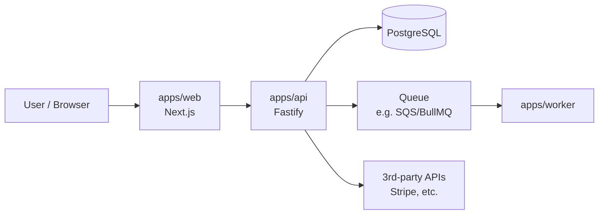

# System Overview

> Audience: anyone (human or AI) who needs the mental model of how this system works.
> Keep this under 2 pages. Details belong in per-component docs.

## 1. Context Diagram (C4 Level 1)

<!-- TEMPLATE: Mermaid diagrams are preferred — AI agents can read AND edit them as text. -->

## 2. Core Data Flow

Describe the 1-3 most important flows in numbered steps. Example:

**User signs up:**
1. `apps/web` posts to `POST /v1/auth/signup`
2. `apps/api` validates via `packages/core/validation`, creates `User` row
3. A `user.created` event is enqueued; `apps/worker` sends the welcome email
4. Session JWT is returned; stored in an httpOnly cookie

## 3. Key Architectural Rules

- All business logic lives in `packages/core` — apps are thin adapters (HTTP, UI, cron)
- Communication between apps is async via the queue; apps never call each other's HTTP APIs directly
- The database is owned by `apps/api`; no other app connects to it directly
- All external API calls go through `packages/integrations` with retries + circuit breaking

## 4. Environments

| Env | URL | Deploys from | Notes |
|-----|-----|--------------|-------|
| local | localhost:3000 | — | Docker Compose for DB/queue |
| staging | staging.example.com | `main` (auto) | Shared, resets weekly |
| production | example.com | release tags (manual approval) | — |

## 5. Where to Go Deeper

- Data model: `docs/architecture/data-model.md`
- Auth: `docs/architecture/auth.md`
- Deployment: `docs/architecture/deployment.md`
- Historical decisions: `docs/decisions/`
